# Schedule

## Gantt Chart

```mermaid
gantt
    title StudyBuddy Schedule Gantt Chart
    todayMarker stroke-width:10px,stroke:#0f0,opacity:0.4
    dateFormat  YYYY-MM-DD
        section Software Development Plan
        Sprint 0: , 2023-02-08, 6d
        section Software Development Plan
        Sprint 0 Planning Meeting: active, 2023-02-10, 1d
        section Software Development Plan
        Brainstorm Progression System: , 2023-02-10, 2d
        section Software Development Plan
        Complete Software Development Plan: , 2023-02-09, 5d
        section Software Development Plan
        Revise Requirements Document: , 2023-02-11, 1d
        section Software Development Plan
        Submit Software Development Plan Assignment: milestone, 2023-02-12, 1d

        section Account Creation, Pet Basics, & Canvas Integration
        Sprint 1: , 2023-02-15, 2w
        section Account Creation, Pet Basics, & Canvas Integration
        Sprint 1 Planning Meeting: active, 2023-02-15, 1d
        section Account Creation, Pet Basics, & Canvas Integration
        Research/learn React, Django:  , 2023-02-16, 13d
        section Account Creation, Pet Basics, & Canvas Integration
        Create user account management system:  , 2023-02-16, 5d
        section Account Creation, Pet Basics, & Canvas Integration
        Decide on pet art style:  , 2023-02-16, 2d
        section Account Creation, Pet Basics, & Canvas Integration
        Create static pet art:  , 2023-02-16, 4d
        section Account Creation, Pet Basics, & Canvas Integration
        Complete Design Document Part 1:  , 2023-02-18, 5d
        section Account Creation, Pet Basics, & Canvas Integration
        Submit Design Document Part 1 (Architecture) Assignment: milestone, , 2023-02-19, 1d
        section Account Creation, Pet Basics, & Canvas Integration
        Complete Design Document Part 2:  , 2023-02-23, 5d
        section Account Creation, Pet Basics, & Canvas Integration
        Submit Design Document Part 2 (API) Assignment: milestone, , 2023-02-26, 1d

        
        section Account Creation, Pet Basics, & Canvas Integration
        Sprint 2: , 2023-03-01, 2w
        section Account Creation, Pet Basics, & Canvas Integration
        Sprint Planning Meeting: active, 2023-03-01, 1d
        section Account Creation, Pet Basics, & Canvas Integration
        Create API: , 2023-03-02, 5d
        section Account Creation, Pet Basics, & Canvas Integration
        Pet naming/selection: , 2023-03-04, 4d
        section Account Creation, Pet Basics, & Canvas Integration
        Set up Canvas integration: , 2023-03-05, 5d
        section Account Creation, Pet Basics, & Canvas Integration
        Create pet display : , 2023-03-05, 5d
        section Account Creation, Pet Basics, & Canvas Integration
        Create account information page : , 2023-03-07, 5d
        section Account Creation, Pet Basics, & Canvas Integration
        Viewable task list : , 2023-03-08, 5d
        section Account Creation, Pet Basics, & Canvas Integration
        Settings Menu : , 2023-03-09, 3d
        section Account Creation, Pet Basics, & Canvas Integration
        User can import tasks from Canvas: , 2023-03-07, 5d
        section Account Creation, Pet Basics, & Canvas Integration
        Host site: milestone, , 2023-03-09, 3d
        section Account Creation, Pet Basics, & Canvas Integration
        Complete Test Procedures Document: , 2023-03-01, 5d
        section Account Creation, Pet Basics, & Canvas Integration
        Submit Test Procedures Document Assignment: milestone, , 2023-03-05, 1d
        section Account Creation, Pet Basics, & Canvas Integration
        Milestone Demo 1 :crit, milestone,  , 2023-03-14, 1d

        section Progression System & Full Task Functionality
        Sprint 3: , 2023-03-15, 2w
        section Progression System & Full Task Functionality
        Sprint Planning Meeting: active , 2023-03-15, 1d
        section Progression System & Full Task Functionality
        User can create Canvas-independent tasks: active , 2023-03-16, 3d
        section Progression System & Full Task Functionality
        User can complete and organize tasks: , 2023-03-20, 4d
        section Progression System & Full Task Functionality
        Implement progression system graphically: , 2023-03-20, 1w
        section Progression System & Full Task Functionality
        Pet can be fed candies: , 2023-03-21, 2d
        section Progression System & Full Task Functionality
        Create the calendar page: , 2023-03-22, 5d
        section Progression System & Full Task Functionality
        Create progress page: , 2023-03-23, 5d
        section Progression System & Full Task Functionality
        Create inventory page: , 2023-03-24, 3d
        section Progression System & Full Task Functionality
        More pet options: , 2023-03-24, 3d
        section Progression System & Full Task Functionality
        Milestone Demo 2 :crit, milestone,  , 2023-03-28, 1d

        
        section Detailed Pet Interactions & Task Reminders
        Sprint 4: , 2023-03-29, 2w
        section Detailed Pet Interactions & Task Reminders
        Sprint Planning Meeting: active , 2023-03-29, 1d
        section Detailed Pet Interactions & Task Reminders
        Make the pet reactive + Multiple frames for each tier: , 2023-03-30, 5d
        section Detailed Pet Interactions & Task Reminders
        Create task/assignment reminders: , 2023-04-05, 5d
        section Detailed Pet Interactions & Task Reminders
        Milestone Demo 3 :crit, milestone,  , 2023-04-11, 1d

        section Final Demo
        Sprint 5: , 2023-04-12, 16d
        section Final Demo
        Sprint Planning Meeting: active , 2023-04-12, 1d
        section Final Demo
        Add more detailed animations for pet states.: active , 2023-04-13, 5d
        section Final Demo
        Add more states/customizations to pet(s): , 2023-04-16, 5d
        section Final Demo
        Final Presentation & Demo :crit, milestone,  , 2023-04-27, 1d
        section Final Demo
        Submit Test Report Document Assignment: milestone, , 2023-05-06, 1d
        section Final Demo
        Submit Final Software Release Assignment: milestone, , 2023-05-07, 1d
```

## Milestone Demo Features

### Milestone Demo 1 [Account Creation, Pet Basics, & Canvas Integration]

- F1: Account Management
    - R1: User is able to register new account.
    - R2: User is able to login with an existing account.
    - R3: User is able to update their account name, and email address.
    - R4: User is able to view their account information.
    - R5: Credentials are authenticated via JWT token.
    - R6: First-time user will be sent a verification email.

- F2: Pet Selection, Customization, and Care
    - R1: User can choose between two virtual pets.
    - R2: User can select between two different cats (color palette).
    - R3: User can name their virtual pet.
    - R4: Users can see a still image of their virtual pet at all times.
    - R5: User sees the pet's mood change temporarily from neutral to happy when they click on it.

- F3: User can link with Canvas LMS
    - R1: Users can access a page listing instructions to connect their Canvas account.
    - R2: Users can see a list of their courses.

- F4: User can view tasks
    - R1: User can view a list of their tasks from Canvas LMS.
    - R4: Tasks will have a name, course with which it is associated, and a description.

### Milestone Demo 2 [Progression System & Full Task Functionality]

- F5: Task Completion and Task Creation
    - R1: User can fill out a form to create a task.
    - R2: Completion of tasks influences virtual pet progress.
    - R3: User can organize tasks in a custom order.
    - R4: Users can import tasks from Canvas LMS multiple times.
    - R5: User can import Canvas assignments as tasks.
    
- F6: Create the inventory page
    - R1: User can view the inventory earned from completing tasks!
    - R2: User can remove candy and place it on their pet (feed it), influencing their pet’s progress
    - R3: Inventory includes different sizes of candies and a rare candy

- F7: User can interact with their pet (feed candies)
    - R1: User can give candy to their virtual pet, affecting its mood and level.
    - R2: User should be able to view task progress and how it affects their virtual pet.
    - R3: See your pet progress toward the next level with a progress bar
    - R4: See your progress towards completion of specific tasks in the Progress page

### Milestone Demo 3 [Detailed Pet Interactions & Task Reminders]

- F8: Make the pet reactive; its mood will visually change
    - R1: User’s progress and task completion will result in virtual pet mood changes.
    - R2: User's virtual pets will be animated.

- F9: Create task reminders/notifications
    - R1: Users receive pop-up notifications when a task’s deadline is near

- F10: Task Organization and Filtering
    - R2. User can filter tasks by course.
    - R3: User can sort tasks by date.

- F11: User can view their tasks on a calendar.
    - R1: The system will present the user with a calendar grid view of their upcoming and past due tasks.
    - R2: the system will support the Gregorian calendar format.
