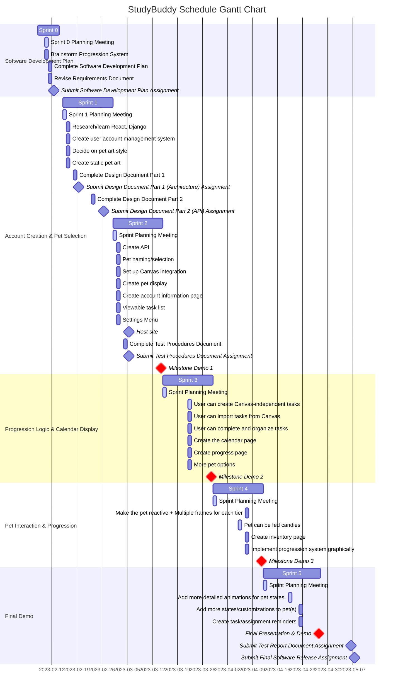

# Schedule

## Gantt Chart

## Milestone Demo Features

### Milestone Demo 1 [Account Creation & Pet Selection]
F: User can create/log in to account

R: User can enter credentials

R: Credentials are authenticated via JWT token

R: First-time user will be sent a verification email

F: User can choose between two pets

R: Select between two different cats (color palette)

R: Name their pet

F: User can view main page with static image of pet

R: Users can see a still image of their pet at all times.

F: User can link with Canvas

R: Users will be redirected to a sign on page to connect to their Canvas account.

R: Users can see a list of their courses.

F: User can view tasks

R: View list of tasks.

R: Sort tasks by date.	

### Milestone Demo 2 [Progression Logic & Calendar Display]
F: User can create Canvas-independent tasks

R: Fill out a task form

R: Save the task form

F: User can navigate to progress page [formerly pet profile page]

R: View their profile.

R: Profile page allows users to view their progress on specific tasks

F: User can complete and organize tasks

R: Completion of tasks influences pet progress

F: Canvas assignments are imported as tasks

R: Tasks will have a name, course with which it is associated, and a description!

R: Users can import tasks multiple times.

F: User can use calendar feature

R: A calendar to show which days a task is due.

F: User can choose between more pets

R: More than one breed of cat.

### Milestone Demo 3 [Pet Interaction & Visually Representing Progression]
F: Make the pet reactive; its mood will visually change

R: User’s progress and task completion will result in mood changes!

R: Pets will be animated.

F: Create the inventory page

R: User can view the inventory earned from completing tasks!

R: User can remove candy and place it on their pet (feed it), influencing their 

pet’s progress

R: Inventory includes different sizes of candies and a rare candy

F: User can interact with their pet (feed candies)

R: More expansive animations

R: User can give candy to their pet, affecting its mood and level

F: Implement progression system visually

R: See your pet progress toward the next level with a progress bar

R: See your progress towards completion of specific tasks in the Progress page

### Final Demo
F: Add more detailed animations for pet states.

R: Pet is asleep after a certain time.

R: Pet has more options for pets/pet colors.

F: Add more customization to pet

R: Create more items for users to give to their pets

F: Create task reminders/notifications

R: Users receive pop-up notifications when a task’s deadline is near
