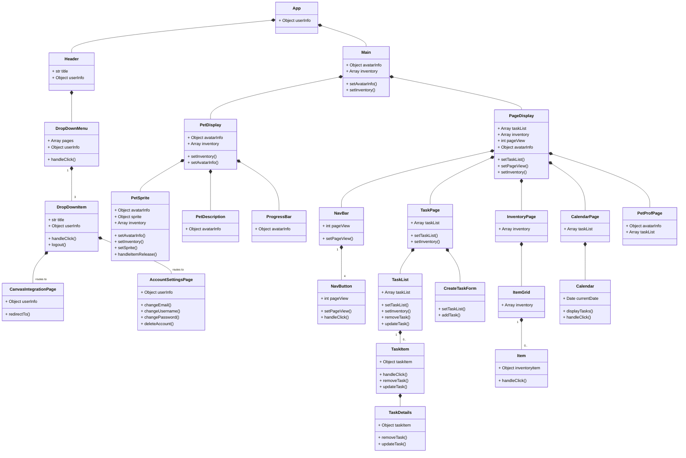
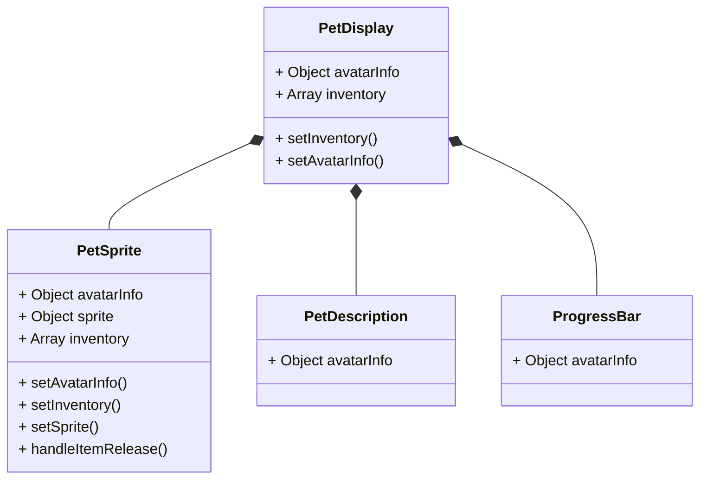
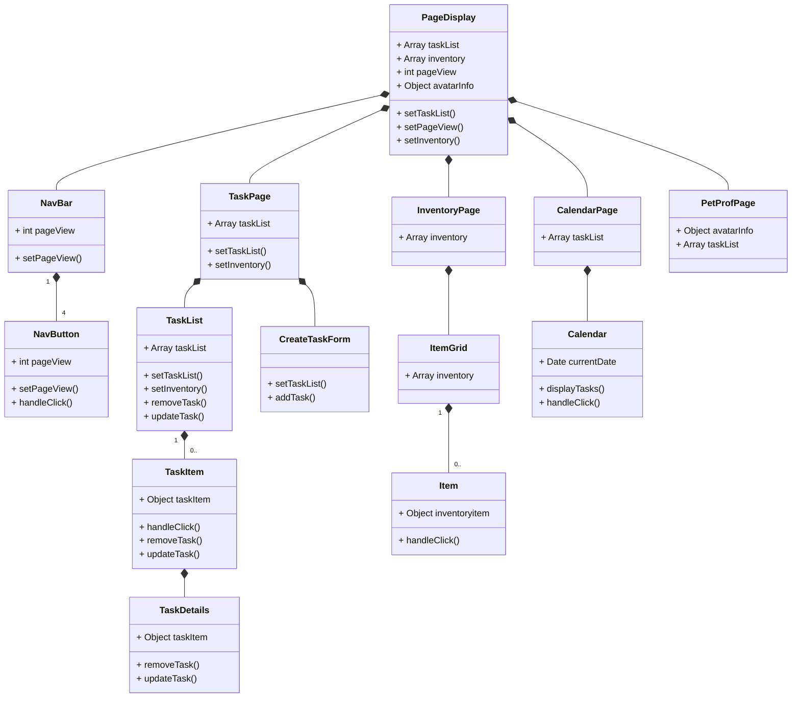

# Class Diagrams

## Backend Class Diagram
For each component provide class diagrams showing the classes to be developed (or used) and their relationship.

## Frontend Class Diagram



### Figure 1.1 UML Class Diagram (All React Components)
Figure 1.1 shows all the React components that make up the frontend of the StudyBuddy site.




### Figure 1.2 UML Class Diagram (PetDisplay React Components)

Figure 1.2 shows the React components that make PetDisplay. This component will be fixed to the left side of the page, allowing users to always see and interact with their pet. 

The PetSprite component displays a sprite of the user's pet, and allows the user to drag items like candy to it from the InventoryPage (Figure 1.3). Candies will change the pet's 'avatarInfo' state, updating information like total EXP and the last time they were fed/interacted with. The 'inventory' state will also change since the user will have one less item from using the candy. The 'sprite' state will also change since a pet's mood can improve from receiving items. The 'sprite' state is owned by the PetSprite component so those changes will cause only that component to re-render.

The components PetDescription and ProgressBar use the state 'avatarInfo' to display information about the user's pet like its name, mood, total EXP, etc. 




### Figure 1.3 UML Class Diagram (PageDisplay React Components)

Figure 1.3 shows the React components that make PageDisplay. This component will allow users to navigate through different pages to help them keep track of their task progress and pet. 

By default the TaskPage is shown, but users can interact with the NavBar component to reach the other component pages like InventoryPage, CalendarPage, and PetProfPage. The PageDisplay component holds the state 'pageView', so when the user selects a NavButton component, the 'pageView' state will change and trigger a re-render to show the correct page.

The TaskPage component's main purpose is to allow users to view, add, delete, and modify their tasks, which is stored in the state 'taskList'. The CreateTaskForm component will allow users to add a new task, and the TaskList component will allow users to select individual TaskItem components to update their progress, change details, or delete them. Further progress on tasks may result in the user receiving a candy, so the state 'inventory' can update due to user interactions with the TaskList component. 

The InventoryPage component uses the state 'inventory' to show and keep track of what items the user has. This component will re-render when that state changes, which can be caused by the user's interactions with the TaskList and PetSprite component.

The CalendarPage component holds the state 'taskList'. It allows users to interact with a calendar and select days to see what tasks are due. It will re-render if changes are made to the 'taskList' state, which could be caused by new tasks pulled from the user's Canvas or their interactions with the TaskList component. 

The PetProfPage component displays the state 'avatarInfo' and 'taskList', showing the user detailed stats on their pet and their overall progress. 


```mermaid
    classDiagram
      

```


### Figure 1.4 UML Class Diagram (Header React Components)

Figure 1.4 shows the components that make up the Header component of the page. Laying along the top, it displays the name of the site and a DropDownMenu component for users to navigate to other pages. 

When the DropDownMenu component is clicked it will display a list of DropDownItem components. These components allow the user to log out and navigate to the CanvasIntegrationPage and AccountSettingsPage components.

The CanvasIntegrationPage component will display text describing what the canvas integration will do, and have a button that will redirect users to complete the OAuth2 process.

The AccountSettingsPage component will display the user's information like username, email, last time logged in, etc, and there will be options for the user to change their email, password, username, and delete their account. 