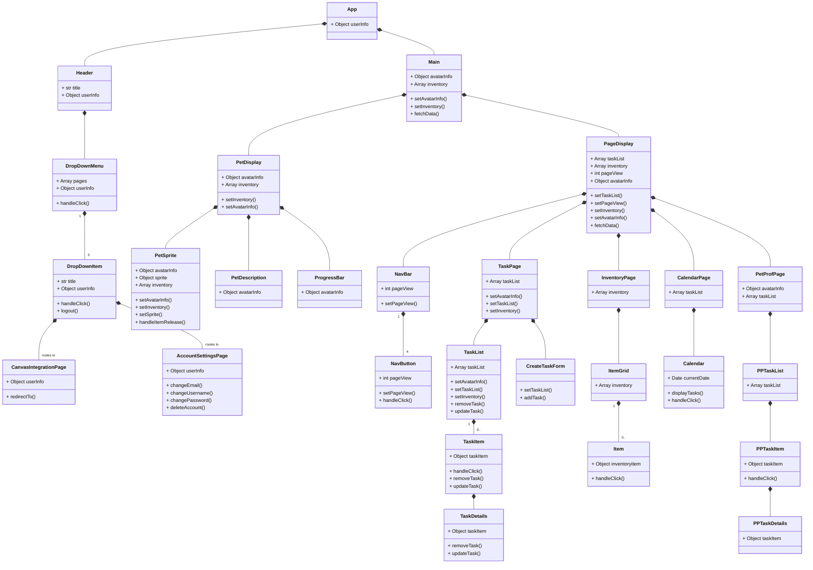
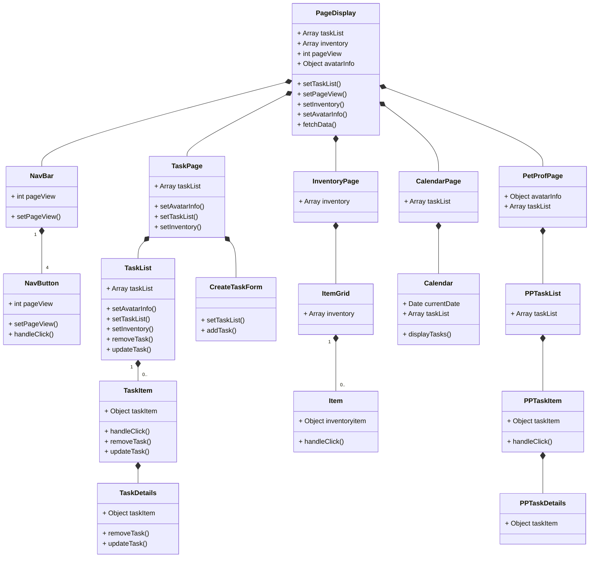
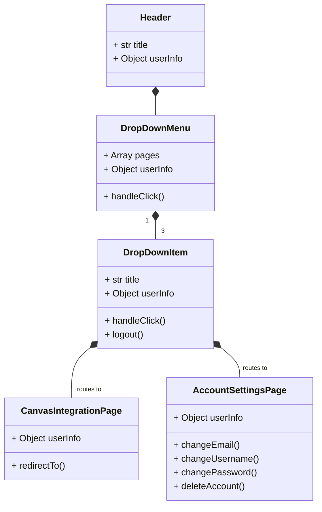

# Class Diagrams

## Backend Class Diagram
For each component provide class diagrams showing the classes to be developed (or used) and their relationship.

## Frontend Class Diagram

#####  Figure 1.1 All React Components
Figure 1.1 shows all the React components that make up the frontend of the StudyBuddy site.

#### App
* The App component is the entire site broken into smaller components. It first splinters into Main and Header. See [Figure 1.4](#header-component) to see the Header component. 

#### Main 
* The Main component owns the 'avatarInfo' and 'inventory' states so the components below can display and make changes to them. It's broken into the components PetDisplay and PageDisplay.
    * See [Figure 1.2](#petdisplay-component) for the PetDisplay component. 
    * See [Figure 1.3](#pagedisplay-component) for the PageDisplay component.

### Site Mockup 

##### Figure 2. Site Mockup

### PetDisplay Component

#####  Figure 1.2 PetDisplay Component
Figure 1.2 shows the React components that make PetDisplay. This component will be fixed to the left side of the page, allowing users to always see and interact with their pet. 

#### PetSprite
* The PetSprite component displays a sprite of the user's pet, and allows the user to drag items like candy to it from the InventoryPage component (See [Figure 1.3](#figure-13-pagedisplay-component)). Candies will change the pet's 'avatarInfo' state, updating information like total EXP and the last time they were fed/interacted with. The 'inventory' state will also change since the user will have one less item from using the candy. The 'sprite' state will also change since a pet's mood can improve from receiving items. The 'sprite' state is owned by the PetSprite component so those changes will cause only that component to re-render.

#### PetDescription and ProgressBar
* The components PetDescription and ProgressBar use the state 'avatarInfo' to display information about the user's pet like its name, mood, total EXP, etc. 

### PageDisplay Component

##### Figure 1.3 PageDisplay Component
Figure 1.3 shows the React components that make PageDisplay. This component is fixed to the right side of the page, and it provides navigation to different pages that will help the user keep track of their task progress and pet. 

#### NavBar
* By default the TaskPage is shown, but users can interact with the NavBar component to reach the other component pages like InventoryPage, CalendarPage, and PetProfPage. The PageDisplay component holds the state 'pageView', so when the user selects a NavButton component, the 'pageView' state will change and trigger a re-render to show the correct page.

#### TaskPage
* The TaskPage component's main purpose is to allow users to view, add, delete, and modify their tasks, which is stored in the state 'taskList'. The CreateTaskForm component will allow users to add a new task, and the TaskList component will allow users to select individual TaskItem components to update their progress, change details, or delete them. Further progress on tasks may result in the user receiving a candy, so the state 'inventory' can update due to user interactions with the TaskList component. 

#### InventoryPage
* The InventoryPage component uses the state 'inventory' to show and keep track of what items the user has. This component will re-render when that state changes, which can be caused by the user's interactions with the TaskList and PetSprite component.

#### CalendarPage
* The CalendarPage component holds the state 'taskList'. It allows users to interact with a calendar and select days to see what tasks are due. It will re-render if changes are made to the 'taskList' state, which could be caused by new tasks pulled from the user's Canvas or their interactions with the TaskList component. 

#### PetProfPage
* The PetProfPage component shows the user detailed stats on their pet and their task progress using the 'avatarInfo' and 'taskList' states. The user's tasks are displayed with a PPTaskList component which is made up of PPTaskItems. When the user clicks on these componenets, a PPTaskDetails component will render, showing the user their progress on the selected task so far. They can not update the task from here. 

### Header Component

##### Figure 1.4 Header Component
Figure 1.4 shows the components that make up Header. Laying along the top, it displays the site's name and a DropDownMenu component for users to navigate to other pages. 

#### DropDownMenu
* When the DropDownMenu component is clicked it will display a list of DropDownItem components. These components allow the user to log out and navigate to the CanvasIntegrationPage and AccountSettingsPage components.

#### CanvasIntegrationPage
* The CanvasIntegrationPage component will display text describing what the canvas integration will do, and have a button that will redirect users to complete the OAuth2 process.

#### AccountSettingsPage
* The AccountSettingsPage component will display the user's information like username, email, last time logged in, etc, and there will be options for the user to change their email, password, username, and delete their account. 

## Django Class Diagram

```mermaid
---
title: Brain Buddies API Class Diagram
---
classDiagram




    UserView <--> UserSerializer
    UserView <--> UserMetaSerializer
    UserMetaView <--> UserMetaSerializer
    AvatarView <--> AvatarSerializer
    InventoryView <--> InventorySerializer
    TaskView <--> TaskSerializer

    InitializerView o-- UserSerializer
    InitializerView o-- AvatarSerializer
    InitializerView o-- TaskSerializer
    InitializerView o-- InventorySerializer
    InitializerView o-- UserMetaSerializer

    UserAvatarListView o-- UserSerializer
    UserAvatarListView o-- AvatarSerializer

    UserInventoryListView o-- UserSerializer
    UserInventoryListView o-- InventorySerializer
    
    UserTaskListView o-- UserSerializer
    UserTaskListView o-- TaskSerializer


    class UserSerializer{
        -String username
        -String firstName
        -String lastName
        -string email
        -datetime lastLogin
        -datetime dateJoined


        +getUserInfo(String username): JSON "username,firstName,lastName,email" 
        +getUserDateInfo(String username): JSON "lastLogin,dateJoined"
    }
    class AvatarSerializer{
        -int avatarId
        -String owner "match username from USER table"
        -String avatarName
        -String avatarType 
        -int totalXp
        -datetime lastInteraction
        -datetime lastFeed

        +getAvatarList(String username): int[] "avatarId"
        +getAvatarInfo(String username,int avatarId): JSON "avatarName,avatarType,totalXp,mood"
        +getMood(String username,int avatarId): String "calculate mood based on last interaction and feeding and return as string"
        
    }
    class TaskSerializer{
        -int taskId
        -String username
        -datetime dueDate
        -bool completed
        -bool recurring
        -int recurrenceTimeDelta
        -String course
        -String description

        +getTaskList(String username):JSON[] "array task objects"
        +getTask(int taskId)

    }
    class InventorySerializer{
        -int inventoryId
        -String candyBaseType 
        -int candyLevel
        -int quantity

        +getInventoryList(String username):JSON[] "array of inventory objects"
        
    }

    class UserMetaSerializer{
        -charfield username
        -datetime birthday
        -textfield description

        +getUserMeta(String username):JSON "usermeta object"
    }

    class UserView{

        +createUser(JSON userObject)
        +update(JSON userObject) 
        +delete(String username) "cascades to destroy all related data"
    }
    class AvatarView{
        
        +create(String username, JSON avatarObject)
        +update(JSON avatarObject)
        +delete(int avatarId)
    }
    class InventoryView{
        +create(String username, JSON inventoryObject) "can fail if attempt to create inventory slot for same base and level"
        +update(JSON inventoryObject)
        +destroy(int inventoryId)
    }
    class TaskView{
        +create(String username, JSON taskObject)
        +update(JSON taskObject)
        +destroy(int taskId)
    }
    class UserMetaView{
        +create(String username, JSON userMetaObject)
        +update(JSON oldMetaObject, JSON newMetaObject) 
        -destroy(String username) "private because cascade will destroy automatically"
    }
    class InitializerView{
        
        +getUserFullDescription(String username): JSON[] "returns deeply nested array containing all information needed to render home page"
    }

    class UserAvatarListView{

        +getAvatarList(String username): JSON[] 

    }
    class UserInventoryListView{
        +getUserInventoryList(String username): JSON[]
        

    }
    class UserTaskListView{
        +getUserTaskList(String username): JSON[]
    }


```

    This class diagram shows the relations between serializer and view classes in our Django backend. 
    Each serializer acts as an adapter for the tables in our database. 
    The view classes represent the functionality of each URL endpoint that will be specified in our API. 
