# Database Diagrams

## Entity-Relation Diagram

````

erDiagram

    USER ||--|{ AVATAR : owns
    USER ||--o{ INVENTORY : owns
    USER ||--o{ TASK : owns
    USER ||--|| USERMETA : owns
    AVATAR }|--|| MOODSTORE : references
    USER {
        charfield username PK 
        string first_name
        string last_name
        string password_hash "PBKDF2 or similar"
        string email
        datetime last_login
        datetime date_joined
        int active_avatar FK "avatar_id from AVATAR table"        
    }

    AVATAR {
        int avatar_id PK
        charfield owner FK "USER - username"
        charfield avatar_name 
        enum avatar_type FK  
        int total_xp 
        datetime last_interaction
        datetime last_feed
        datetime birthday
        string flavour_text "u for uropian"
    }

    INVENTORY {
        int inventory_id PK
        charfield username FK
        enum candy_base_type "SMALL, MEDIUM, LARGE, CAKE"
        enum candy_level "multiplier for basetype, BEGINNER,
            NOVICE,INTERMEDIATE, ADVANCED, EXPERT"   
        int quantity
        
    }

    TASK {
        int task_id PK
        charfield username FK
        datetime due_date "optional"
        bool completed "default = False"
        bool recurring "default = False"
        int recurrence_time_delta "optional default = 0, required if recurring"
        int completion_status "1-4"
        charfield course "optional - link Canvas task with course"
        textfield description "optional field giving notes about task"

    }

    USERMETA {

        charfield username FK
        datetime birthday "Optional: Can get a birthday notification and Pet State will go to GREAT"
        textfield description "Optional: User can give a brief description of their goals for profile"

    }

    MOODSTORE {

        charfield avatar_type PK
        charfield moodpath_sad "filename in static store"
        charfield moodpath_neutral "filename in static store"
        charfield moodpath_happy "filename in static store"

    }


```

    This diagram shows the individual tables and their relations in our SQLite data-base. The tables are as follows:

	- USER the Django default user implementation 
	- AVATAR holds pet information and relate back to USER(many2one)
	- TASK holds tasks specified by USER(many2one)
	- INVENTORY holds inventory items currently held by USER(many2one)
	- USERMETA holds additional optional information about USER(one2one)
	- MOODSTORE relates animation frame palettes to AVATAR(one2many)

## Django Class Diagram


```




```mermaid
---
title: Brain Buddies API Class Diagram
---
classDiagram




    UserView <--> UserSerializer
    UserView <--> UserMetaSerializer
    UserMetaView <--> UserMetaSerializer
    AvatarView <--> AvatarSerializer
    InventoryView <--> InventorySerializer
    TaskView <--> TaskSerializer

    InitializerView o-- UserSerializer
    InitializerView o-- AvatarSerializer
    InitializerView o-- TaskSerializer
    InitializerView o-- InventorySerializer
    InitializerView o-- UserMetaSerializer

    UserAvatarListView o-- UserSerializer
    UserAvatarListView o-- AvatarSerializer

    UserInventoryListView o-- UserSerializer
    UserInventoryListView o-- InventorySerializer
    
    UserTaskListView o-- UserSerializer
    UserTaskListView o-- TaskSerializer


    class UserSerializer{
        -String username
        -String firstName
        -String lastName
        -string email
        -datetime lastLogin
        -datetime dateJoined


        +getUserInfo(String username): JSON "username,firstName,lastName,email" 
        +getUserDateInfo(String username): JSON "lastLogin,dateJoined"
    }
    class AvatarSerializer{
        -int avatarId
        -String owner "match username from USER table"
        -String avatarName
        -String avatarType 
        -int totalXp
        -datetime lastInteraction
        -datetime lastFeed

        +getAvatarList(String username): int[] "avatarId"
        +getAvatarInfo(String username,int avatarId): JSON "avatarName,avatarType,totalXp,mood"
        +getMood(String username,int avatarId): String "calculate mood based on last interaction and feeding and return as string"
        
    }
    class TaskSerializer{
        -int taskId
        -String username
        -datetime dueDate
        -bool completed
        -bool recurring
        -int recurrenceTimeDelta
        -String course
        -String description

        +getTaskList(String username):JSON[] "array task objects"
        +getTask(int taskId)

    }
    class InventorySerializer{
        -int inventoryId
        -String candyBaseType 
        -int candyLevel
        -int quantity

        +getInventoryList(String username):JSON[] "array of inventory objects"
        
    }

    class UserMetaSerializer{
        -charfield username
        -datetime birthday
        -textfield description

        +getUserMeta(String username):JSON "usermeta object"
    }

    class UserView{

        +createUser(JSON userObject)
        +update(JSON userObject) 
        +delete(String username) "cascades to destroy all related data"
    }
    class AvatarView{
        
        +create(String username, JSON avatarObject)
        +update(JSON avatarObject)
        +delete(int avatarId)
    }
    class InventoryView{
        +create(String username, JSON inventoryObject) "can fail if attempt to create inventory slot for same base and level"
        +update(JSON inventoryObject)
        +destroy(int inventoryId)
    }
    class TaskView{
        +create(String username, JSON taskObject)
        +update(JSON taskObject)
        +destroy(int taskId)
    }
    class UserMetaView{
        +create(String username, JSON userMetaObject)
        +update(JSON oldMetaObject, JSON newMetaObject) 
        -destroy(String username) "private because cascade will destroy automatically"
    }
    class InitializerView{
        
        +getUserFullDescription(String username): JSON[] "returns deeply nested array containing all information needed to render home page"
    }

    class UserAvatarListView{

        +getAvatarList(String username): JSON[] 

    }
    class UserInventoryListView{
        +getUserInventoryList(String username): JSON[]
        

    }
    class UserTaskListView{
        +getUserTaskList(String username): JSON[]
    }


```

    This class diagram shows the relations between serializer and view classes in our Django backend. Each serializer acts as an adapter for the tables in our database. The view classes represent the functionality of each URL endpoint that will be specified in our API. 
