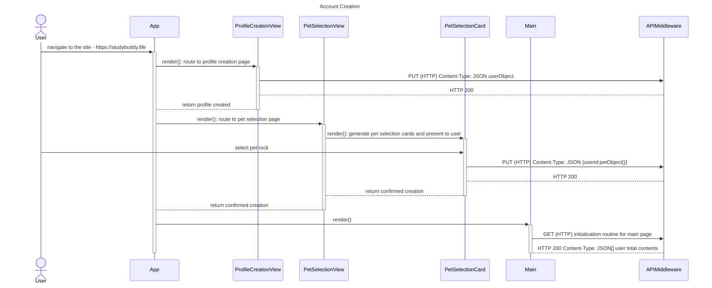
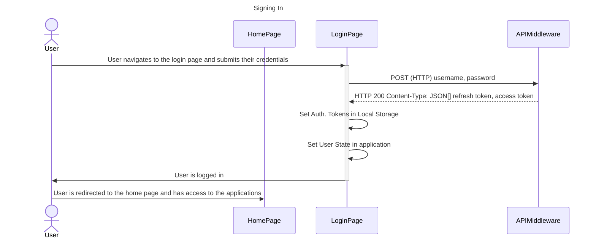
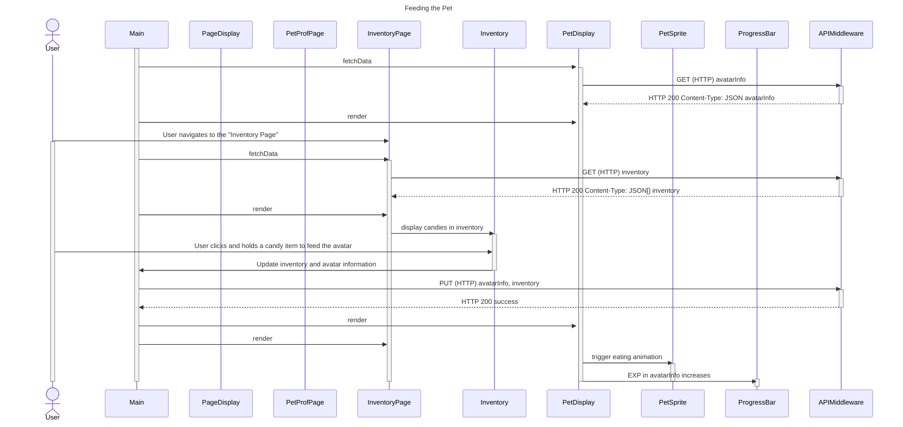
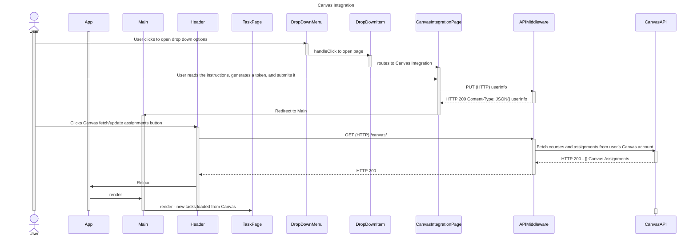
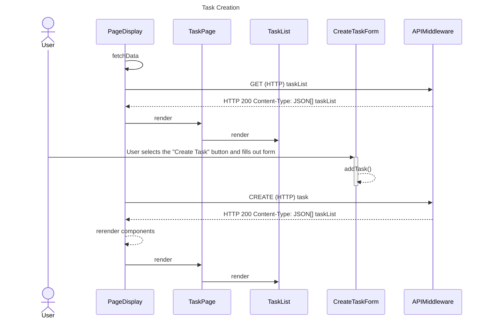
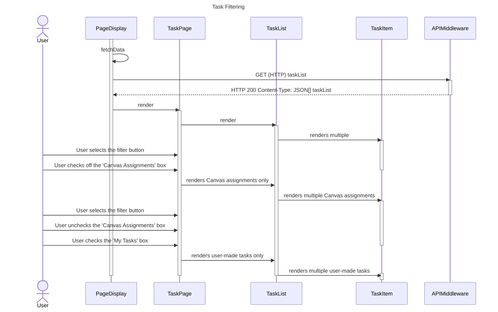
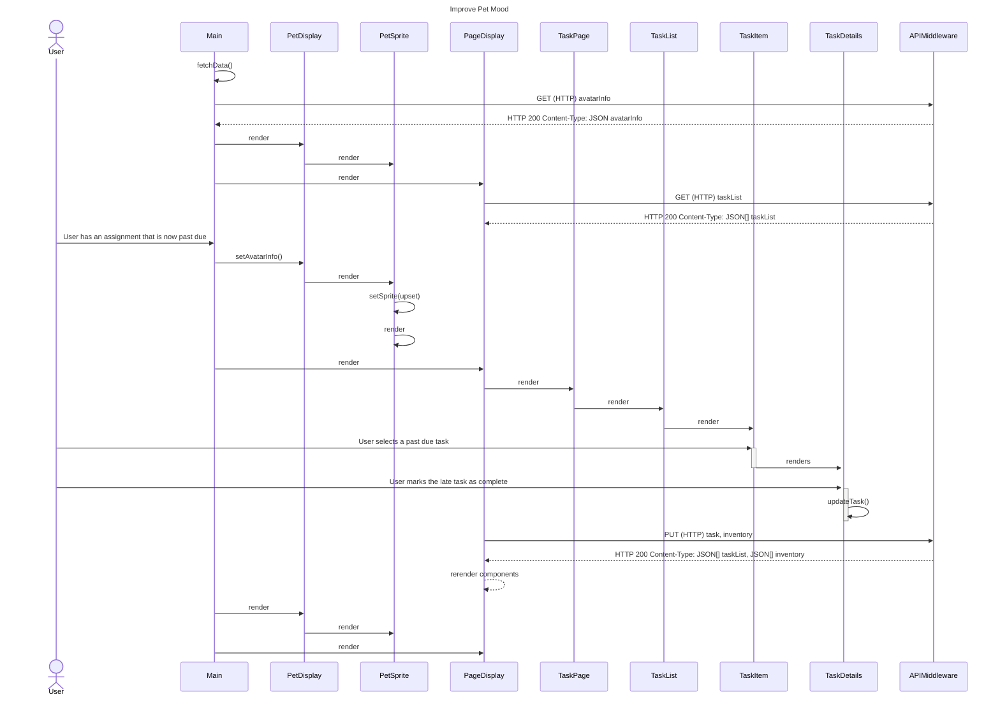

# Sequence Diagrams

## Use Case 1

**As a user, it is important that I can create an account so that I can maintain my pet’s growth and my task progress.**

    1. Upon accessing the web application for the first time at studybuddy.life, the user is directed to a landing page. There are buttons for creating an account and logging in.
    2. The user selects the 'Register' button to access the account registration form.
    3. The user inputs their username, email address, password, and other optional fields, and clicks the 'Sign Up' button to submit the form. If the information is valid, the user is notified that their account creation was successful.
    4. The user selects the 'Sign In' link to access the sign-in page, and enters in their email and password.
    5. Since the user is logging in for the first time, they are redirected to a pet selection page where they can click through a carousel of different cats and a rock.
    6. The user chooses the rock and names it.
    7. The site redirects the user to the home page of the site where they can see their pet at level.

    
## Use Case 2 
**As a user, I want to be able to log into an account to view my my progress and tasks.**

    1. The user accesses the site by going to 'studybuddy.life'. 
    2. The user selects the 'Login' button to access the sign-in page.
    3. The user enters their email address and password.
    4. If the credentials are valid, The user is redirected to the home page where they can see their pet and their tasks. If not, the user will be notified that the credentials are invalid. 

## Use Case 3
**As a user, I want to keep my pet happy and help it grow by completing tasks and receiving candies.**

    
    This sequence diagram displays the way in which the user can feed candies collected from completing tasks to their avatar by clicking and holding on candies
    from the Inventory Page.

    1. The user navigates to the inventory page.
    2. The user can see their collection of candies. Candy types are based on completion of tasks of different sizes and levels.
    3. The user clicks and holds a candy to feed their pet. As a result, the pet becomes visibly happy and it gains EXP.

## Use Case 4
**As a user, I want to import my Canvas assignments.**

    This sequence diagrams shows how a user can link Canvas to their Virtual Pet Study Buddy. The user will navigate to the 
    CanvasIntegrationPage (after creating an account and profile). They will be provided instructions on how to retrieve and submit a Canvas token.
    After a successful token submission, the user's canvas assignments can be imported and updated. 
    
    1. The user navigates to the 'Canvas Integration' page.
    2. The user reads a set of instructions guiding them on how to import Canvas assignments using a token.
    3. The user copies and pastes their token into an input box and submits.
    4. Once the token is successfully saved, a button with the canvas logo will appear in the header for desktop and footer for mobile.
    5. The user can click the button to import their assignments for the first time, or update existing Canvas assignments.
    6. Once the assignments are imported, the user sees them listed on the task page.

## Use Case 5 - Task Creation
**As a user, I want to create my own tasks.**

    1. The user logs into their profile.
    2. The user selects the “Create Task” button on the task page.
    3. The user fills out the 'Create Task' form with information like a title, description, estimated time to complete a task, a due date, and tags for sorting.
    4. The user selects the 'Create' button. They can now see this task on the task page.

## Use Case 6
**As a user, I want my study app to help me organize and keep track of my tasks by allowing me to update and sort them.**

    1. The user logs into their profile. They want to view their Canvas courses and user-made tasks separately. 
    2. From the task page, the user selects the filter button next to the 'Create Task' button and sorts tasks by the 'Canvas Assignments' tag. The user can now see all their Canvas assignments.
    3. The user un-checks the 'Canvas Assignment' tag and checks the 'My Tasks' tag. They can now only see the tasks they've made.

## Use Case 7
**As a user, I want to help improve my pet's mood if I forget to complete a task.**

    1. The user has an overdue task. As a result, the pet is visibly upset.
    2. The user checks off the assignment as finished and receives a candy.
    3. The user feeds their pet as described in Use Case 3.
    4. The pet's mood improves and becomes visibly happy.

