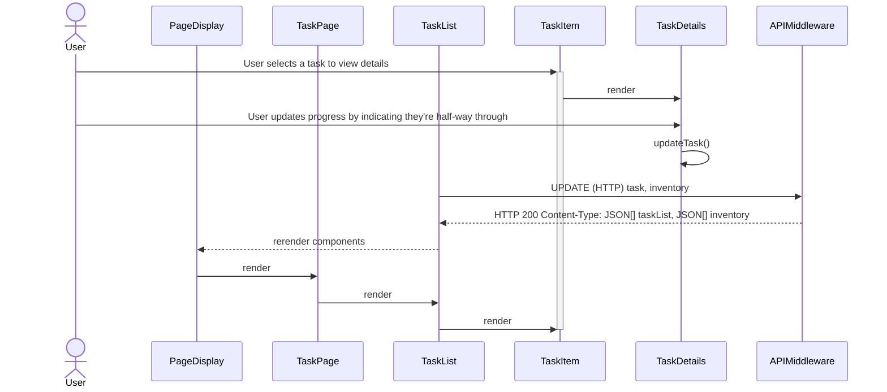

# Sequence Diagrams

## Use Case 1

## Use Case 2

## Use Case 3

## Use Case 4

## Use Case 5

```mermaid
sequenceDiagram
    actor User as User
    participant PageDisplay
    participant TaskPage
    participant TaskList
    participant TaskItem
    participant TaskDetails
    participant APIMiddleware
    
    User->>+TaskItem: User selects a task to view details
    TaskItem->>TaskDetails: render
    User->>TaskDetails: User updates progress by indicating they're half-way through
    TaskDetails->>TaskDetails: updateTask()
    %% Note over TaskDetails 
    TaskList->>APIMiddleware: UPDATE (HTTP) task, inventory
    APIMiddleware-->>TaskList: HTTP 200 Content-Type: JSON[] taskList, JSON[] inventory
    TaskList-->>PageDisplay: rerender components 
    PageDisplay->>TaskPage: render
    TaskPage->>TaskList: render
    TaskList->>TaskItem: render
    deactivate TaskItem
```

## Use Case 6

## Use Case 7

## Use Case 8
