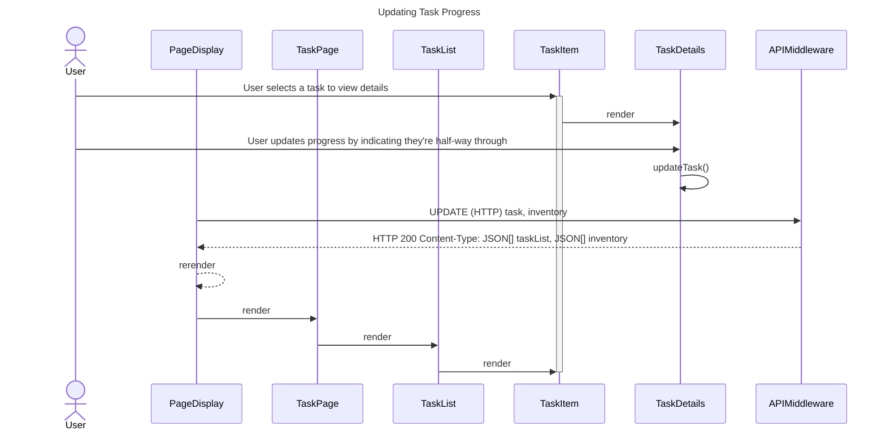
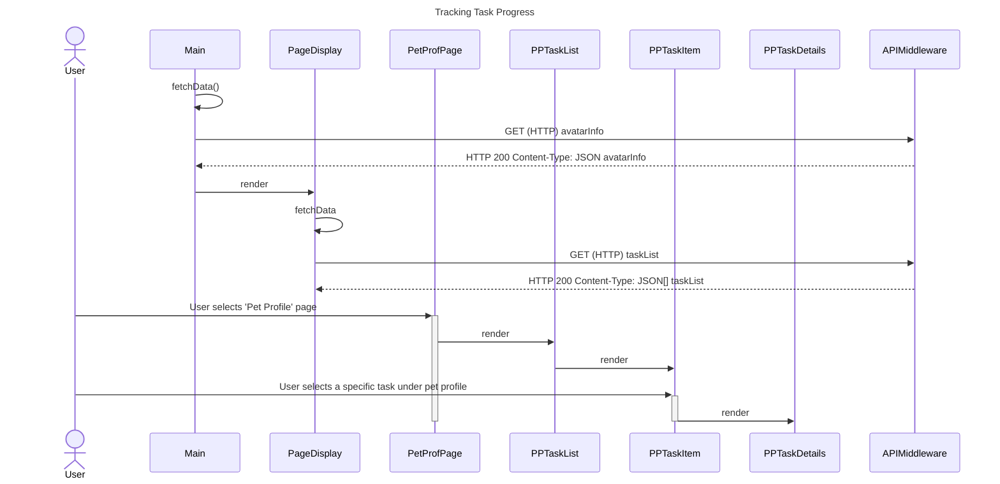

# Sequence Diagrams

## Use Case 1

## Use Case 2

## Use Case 3

## Use Case 4

## Use Case 5

## Use Case 6

This sequence diagram displays the way in which the user can use the Pet Profile page to see more information about their progress, as shown in Use Case 6. By selecting a task under the pet profile page, they can see their current progress towards completing it, as well as the time remaining before the deadline (whether it be a self-set deadline, or one imposed by Canvas).
1. The avatar information is retrieved through an API call.
2. The page display component is rendered.
3. The list of tasks is retrieved through an API call.
4. The user selects 'Pet Profile' page, and selects a specific task to see more information.
5. The pet profile page renders the task list, task item, and task details components.

## Use Case 7

## Use Case 8
