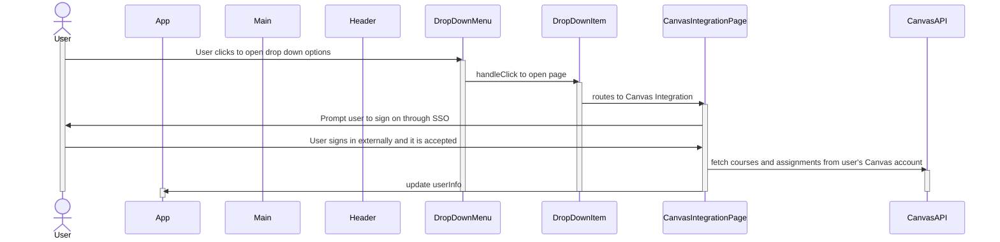
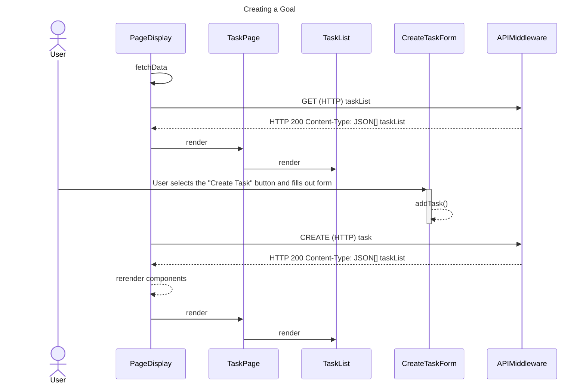
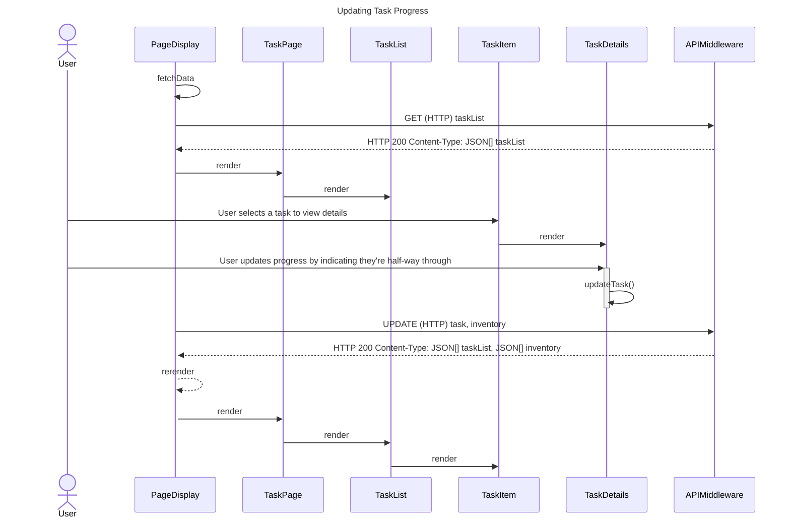
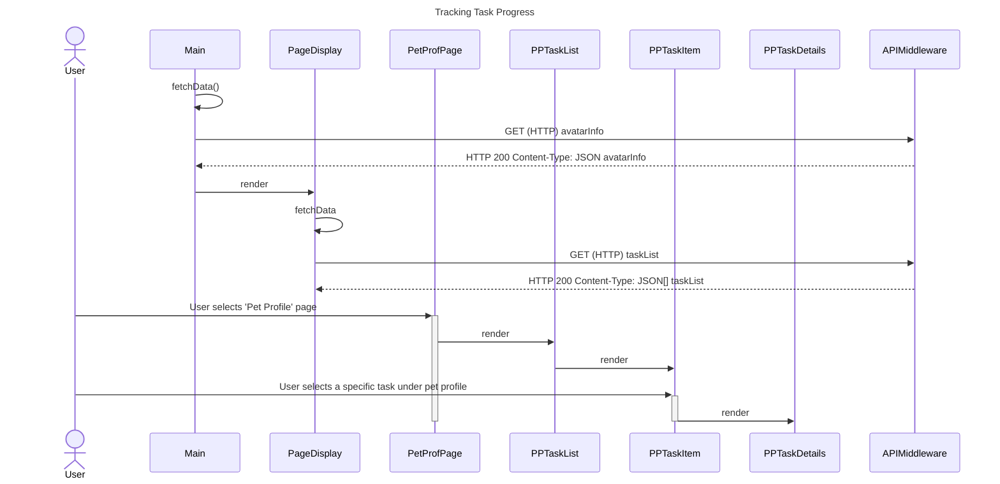
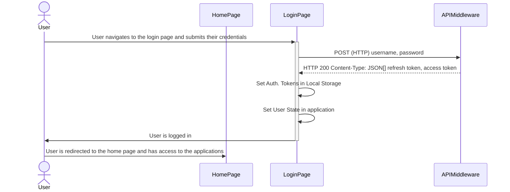
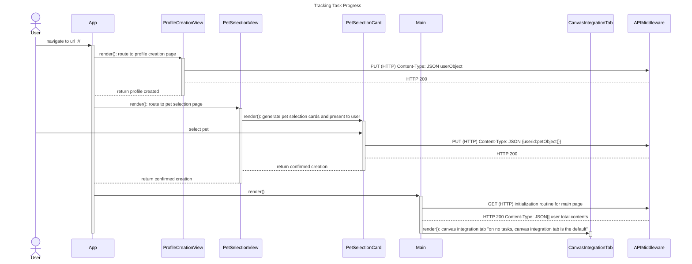

# Sequence Diagrams

## Use Case 1
### As a user, I want to use the resources I've collected in the application to progress my avatar.

    
This sequence diagram displays the way in which the user can feed candies collected from completing tasks to their avatar by dragging and dropping candies from the Inventory Page to their avatar which is shown in the Pet Display. 
1. The user navigates to the InventoryPage in the PageDisplay portion of the screen on the right. The inventory data is fetched through an API call.
2. The user views a set of acquired rewards on the InventoryPage in the form of ‘candies’ which are contained as Items in an ItemGrid in the Inventory.
3. The user drags a 'candy' to the avatar, and the Inventory is updated to reflect the removal of a candy. An API call updates the inventory list.
3. The user drops the 'candy' onto their avatar on the lefthand side of the screen, and it shows an eating animation and a satisfied animation.
4. The avatarInfo is updated which contains the EXP data, which causes the progress bar to update, increasing when the ‘candy’ is consumed.

## Use Case 2
### As a user, I want to link Canvas to my Virtual Pet.

This sequence diagrams shows how a user can link Canvas to their Virtual Pet Study Buddy. The user will navigate to the CanvasIntegrationPage (after creating an account and profile). They will be prompted to sign in with SSO authentication. After a successful sign-in, the user's data will be updated such that their assignments and courses will be imported into their account.

1. The user creates an account and profile as described in Use Case 8.
2. The user navigates to the Canvas Integration section of the site.
3. The user signs on through SSO.
4. Courses as assignment data are imported into the user's info.

## Use Case 3

## Use Case 4
### As a user, I want to create a schedule and be encouraged by my Virtual Pet to adhere to the schedule.
<!-- 

  
Use Case 4 Description

  

    

1. The user logs into their profile. ([See Use Case 7](#use-case-7))
2. User navigates to the “Create Task” tab.
3. User fills out a form with types of milestones and calendar information regarding due dates. These can be explicit calendar entries based on a particular date, or recur on a regular time interval.
4. The backend for the site builds a set of events for the avatar based on these milestones.

    

  

 -->

## Use Case 5
### As a user, I want to have my study app stay up to date on my progress towards my study goals.
<!-- 

  
Use Case 1 Description

  

    

1. The user logs into their profile. ([See Use Case 7](#use-case-7))
2. The task list is retrieved with a GET call to the API.
2. From the homepage, the user can select a specific task to see more information.
3. After selecting a task, the user may update their progress by indicating they are halfway through, a quarter of the way through, etc.
4. The task list is updated with a PUT call to the API.
4. After progressing further towards completing a task, the user’s pet will receive EXP in the form of candy towards its next level.

    

  

 -->

## Use Case 6
### As a user, I want to be able to track my pet’s growth and my progress towards reaching my study goals.

This sequence diagram displays the way in which the user can use the Pet Profile page to see more information about their progress, as shown in Use Case 6. By selecting a task under the pet profile page, they can see their current progress towards completing it, as well as the time remaining before the deadline (whether it be a self-set deadline, or one imposed by Canvas).
1. The avatar information is retrieved through an API call.
2. The page display component is rendered.
3. The list of tasks is retrieved through an API call.
4. The user selects 'Pet Profile' page, and selects a specific task to see more information.
5. The pet profile page renders the task list, task item, and task details components.

## Use Case 7: 
### As a user, I want to be able to log into an account so that my progress and tasks will be saved.

## Use Case 8

As a user, it is important that I can create an account so that I can maintain my pet’s growth and my task progress.

    Upon accessing the web application for the first time, the user is given the option to create an account.
    The user inputs their email address and creates a password to create their account.
    After creating the account, the user sees a page allowing them to choose a pet out of a selection of avatars.
    The user selects a pet.
    The site automatically navigates to the Canvas Integration tab.
    The user chooses whether to integrate with their Canvas account.
    The user now has access to creating tasks and growing their pet.
